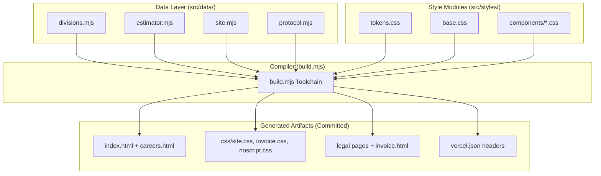
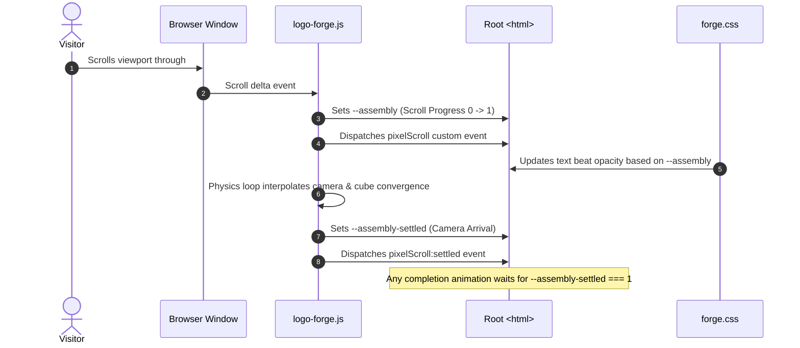

# Technical Architecture & Systems — Fused Protective Services

This document details the software architecture, compilation pipeline, templating engine, WebGL voxel assembly, and client state subsystems of the **Fused Protective Services** platform.

---

## 🏛️ System Philosophy: Zero Dependencies

The entire platform is built with a zero-dependency architecture:

* **No root `package.json` or `node_modules`:** The static site and `api/` have zero npm dependencies at runtime or build time. The operations portal in `app/` is a separate pnpm workspace with its own dependencies (see the end of this document).
* **Pure Node.js ESM:** The build pipeline relies strictly on Node's native standard library (`node:fs`, `node:url`, `node:path`).
* **Committed Output:** Every generated file (all pages, `css/*.css`, and `vercel.json`) is checked into Git, so Vercel serves the root with no build step. The security headers live in the generated `vercel.json`, so another static host would need them re-created before it could serve this site safely.



---

## ⚙️ The Compiler Toolchain (`build.mjs`)

The compilation pipeline executes via `node build.mjs`. It orchestrates data binding, HTML generation, and CSS concatenation.

### 1. Style Pipeline & Cascade Layering
CSS files are concatenated in an explicit order defined by `STYLE_ORDER` (never alphabetical). The compiler wraps all modules in a single `@layer` declaration:

```css
@layer tokens, base, layout, components, utilities;
```

This guarantees that:
1. `tokens` establish global variables.
2. `base` defines resets and foundational styles.
3. `layout` dictates section architecture.
4. `components` define isolated widgets.
5. `utilities` always win specificity over components without using `!important`.

### 2. Build Targets
The compiler builds three page bundles plus the deployment config:
1. **Marketing & Quote Intake (`index.html` + `css/site.css`):** Dark tactical UI, WebGL intro, interactive quiz, budget calculator, and quote intake form.
2. **Legal pages and the legacy invoice export (`privacy.html`, `terms.html`, `sms-consent.html`, `invoice.html`):** generated from `src/data/legal.mjs` and `src/templates/invoice/page.mjs`.
3. **Careers & Recruitment Portal (`careers.html` + `css/site.css`):** Interactive job board, 5-stage vetting protocol, 60-second eligibility pre-check, and candidate intake form with Google Jobs Schema.org markup.
4. **`css/noscript.css` and `vercel.json`:** no-JavaScript fallback styles, and the Vercel config with clean URLs plus the Content-Security-Policy (a sha256 for every inline JSON `<script>` block), HSTS and frame headers. `vercel.json` changes whenever `src/data/` does; see `docs/RUNBOOK.md` §8b.

### 3. Drift Verification (`--check`)
In CI/CD or pre-commit hooks, `node build.mjs --check` verifies that every committed generated file, `vercel.json` included, matches `src/` byte-for-byte. `node build.mjs --verify-release` additionally exits `1` while any `placeholder: true` fact remains. If any developer has manually edited a generated file or failed to rebuild after editing `src/`, the process exits with code `1`.

---

## 🔤 Tagged Template Compiler (`src/lib/html.mjs`)

Templates are rendered using native JavaScript tagged template literals with built-in contextual escaping:

```javascript
import { html, raw, json } from './lib/html.mjs';

export const card = (division) => html`
    <article class="division-card" data-division="${division.id}">
        <h3>${division.heading}</h3>
        <p>${division.description}</p>
        <div class="icon">${raw(division.svgIcon)}</div>
    </article>
`;
```

### Safety Invariants
* **Escaping by Default:** Any interpolated variable (`${value}`) is automatically escaped (`&`, `<`, `>`, `"`, `'`).
* **The `raw()` Opt-In:** Only pre-rendered markup generated by trusted internal functions (such as SVG icons) may be wrapped in `raw()`. Never wrap user-submitted input in `raw()`.
* **Array Joining:** Arrays are recursively flattened and joined with empty strings (`""`), allowing clean functional mapping (`${items.map(renderItem)}`).
* **The `json()` Helper:** Serializes data objects while escaping `<` to `\u003c`, preventing script-injection vulnerabilities when serializing state islands.

---

## 🧊 The WebGL Voxel Assembly Engine (`js/logo-forge.js`)

The page opens on a scroll-driven WebGL experience adapted from the *Pixel Scroll Forge* engine. The gold shield emblem is shattered into ~65,000 3D voxel cubes scattered across 3D space. As the user scrolls through the `#assembly-intro` viewport track, the cubes fuse into the finished brand plate.



### The Dual-Clock System
The engine publishes two distinct progress clocks on `document.documentElement`:

1. `--assembly` **(Scroll Position):** Directly reflects the normalized scroll progress between `0.0000` and `1.0000`. The introductory copy beats ride this clock.
2. `--assembly-settled` **(Camera & Cube Arrival):** Tracks the real, physical convergence of the Three.js camera and voxel cubes.

> [!IMPORTANT]
> `--assembly` reaches `1.0000` the instant the user stops scrolling, but cubes may still be settling. Any downstream logic asserting completion **must strictly monitor `--assembly-settled`**.

### Resiliency & Fallbacks
* **Three.js is vendored, not fetched.** `js/logo-forge.js` does a static `import * as THREE from './vendor/three.module.js'`. There is no CDN, no fallback host, and no "every host is unreachable" branch — those were removed by SPEC-006. `js/vendor/three.module.js` holds r160 byte-for-byte from the URL the old dynamic import named, with the MIT header intact, a provenance comment recording the version, source URL and sha256, and the full permission notice in `js/vendor/three.LICENSE`. `tests/csp.test.mjs` re-checks the hash, so a silently patched vendor file fails the suite.
  **The page now has no external script dependency of any kind**, which is what lets `script-src` be `'self'` with no allowlisted origin. To upgrade three.js, follow the recipe in `docs/RUNBOOK.md` — never patch vendored code in place.
* **Fonts are vendored too.** Cinzel, Outfit and JetBrains Mono are variable fonts served from `assets/fonts/` (10 woff2, unicode-range gated so a visitor fetches two of them), declared as `@font-face` in `src/styles/base.css`, with OFL licences and an `assets/fonts/SOURCES.txt` manifest committed alongside. No `fonts.googleapis.com`, no `fonts.gstatic.com`, no preconnects.
* **Fallback Mounting:** If WebGL is unsupported or hardware-disabled, or the context is lost, the engine sets `html[data-forge-fallback="true"]`. The CSS collapses the multi-height scroll track and mounts a static 2D fallback shield (the brand plate; the unserved `assets/logo.png` master is never linked).
* **Reduced Motion:** If `prefers-reduced-motion: reduce` is active, the WebGL loop disables kinetic scattering and immediately positions the camera at the assembled coordinate.

---

## 🏝️ Client Island Architecture (`#fps-config`)

To keep client JavaScript lightweight and prevent data duplication, the build process injects a JSON data island into `index.html`:

```html
<script type="application/json" id="fps-config">
{
  "divisions": [...],
  "estimator": {...},
  "site": {...},
  "intake": {...}
}
</script>
```

In the browser, `js/modules/config.mjs` parses this island once:

```javascript
// js/modules/config.mjs
const raw = document.getElementById('fps-config')?.textContent;
export const config = raw ? JSON.parse(raw) : {};
```

* **No Hardcoded Business Logic in JS:** Browser modules for the assessment quiz (`assessment.mjs`), estimator calculator (`estimator.mjs`), and bookshelf expander (`bookshelf.mjs`) pull rates and division names directly from `config`.

---

## 🧾 `/invoice` — legacy export page

The browser-only invoice builder was retired in Phase 1. `invoice.html` (still generated from `src/templates/invoice/page.mjs`) reads any records the old tool left in `localStorage` (`fps_invoices_v1`) and presents them as JSON for **Portal → Invoices → Import legacy**. Invoicing itself — numbering, sending, payment — lives in the operations portal below.

---

## 🏛️ Operations Portal (`app/`, Phase 1)

Everything authenticated lives in a second workspace so the zero-dependency marketing build stays untouched:

* **Stack:** Next.js 16 App Router (TypeScript, Turbopack, pnpm), Supabase (Postgres, Auth, RLS), Stripe, Resend, Twilio. Server components + server actions; the only client components are the login and MFA forms, the Security panel, and a print button.
* **Host:** Vercel project `fused-portal`, root directory `app/`, served at `fused-portal.vercel.app` (→ `app.fusedprotectiveservices.com`). Chosen over `/portal/*` on the marketing host so auth cookies stay on the app origin and the static project remains a pure static deploy.
* **Shared facts:** `app/scripts/sync-shared.mjs` mirrors `src/data`, `src/lib`, `src/styles/tokens.css` and `api/_lib` into `app/shared/` (gitignored) before build/typecheck/test; `app/src/lib/shared.ts` is the single import point. The portal and the site can never disagree on a rate, a division name, a term or the dispatch line.
* **Design language:** `app/src/styles/app.css` adds layout and component vocabulary on top of the site's `tokens.css`; the client-facing paper (proposal, invoice) is gold-on-white and prints to one Letter page.
* **Layout:** `app/src/app` (routes), `app/src/lib/{auth,actions,domain,notifications,stripe,qr,money,format}`, `app/src/components`, `app/tests`, `app/scripts`.
* **Security:** staff TOTP is enforced in the database by `is_staff()`; sign-in attempts are rate-limited through `intake_gate`; sessions end after 8 h idle or 72 h total; a nonce-based CSP and HSTS are set by `app/src/proxy.ts` and `next.config.ts`. Next 16 with a `src/` layout runs only `src/proxy.ts`, never a root `proxy.ts`.
* **Audit trail:** `public.audit_log` is trigger-fed and append-only; record timelines and Portal → Activity read it.
* **Candidate ATS:** Portal → Candidates lists and stages `/careers` applications one stage at a time, production rows only (SPEC-010).
* **Environment separation:** `deployEnv()` (`api/_lib/env.mjs`) returns `production` only when `VERCEL_ENV` says so. Non-production rows carry `source_env`, non-production sends are skipped and reported as `non_production_env`, and the scheduler filters to production rows.
* **Observability:** `api/_lib/report.mjs` on the static side and `@sentry/nextjs` in the portal (server and edge only, inactive until `SENTRY_DSN` is set). Browser errors reach `/api/client-error` without PII; alert storms are deduplicated through `alert_gate()`.
* **Migrations are not deployed by Git.** A push ships code but never changes the hosted database; apply new migrations by hand before or with the code that needs them (`docs/RUNBOOK.md` §1).
