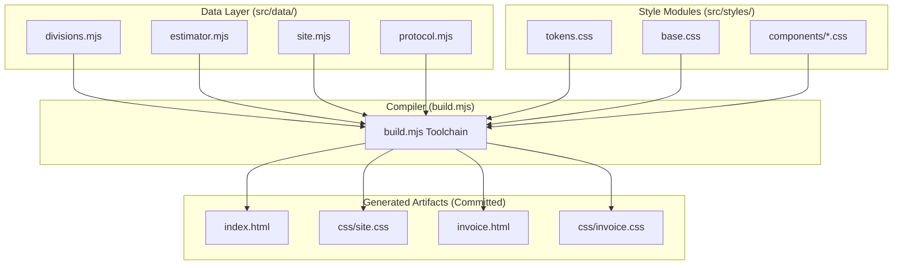
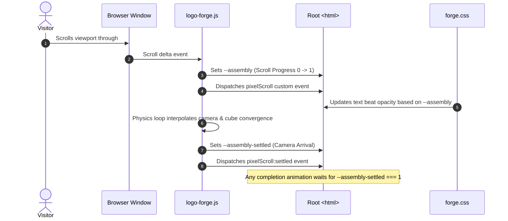

# Technical Architecture & Systems — Fused Protective Services

This document details the software architecture, compilation pipeline, templating engine, WebGL voxel assembly, and client state subsystems of the **Fused Protective Services** platform.

---

## 🏛️ System Philosophy: Zero Dependencies

The entire platform is built with a zero-dependency architecture:

* **No `package.json` or `node_modules`:** There are zero npm dependencies at runtime or build time.
* **Pure Node.js ESM:** The build pipeline relies strictly on Node's native standard library (`node:fs`, `node:url`, `node:path`).
* **Deployable Anywhere:** Because all generated assets (`index.html`, `invoice.html`, `css/*.css`) are checked into Git, the repository can be hosted instantly by dragging the root directory onto Vercel, Netlify, or Cloudflare Pages without a build step.



---

## ⚙️ The Compiler Toolchain (`build.mjs`)

The compilation pipeline executes via `node build.mjs`. It orchestrates data binding, HTML generation, and CSS concatenation.

### 1. Style Pipeline & Cascade Layering
CSS files are concatenated in an explicit order defined by `STYLE_ORDER` (never alphabetical). The compiler wraps all modules in a single `@layer` declaration:

```css
@layer tokens, base, layout, components, utilities;
```

This guarantees that:
1. `tokens` establish global variables.
2. `base` defines resets and foundational styles.
3. `layout` dictates section architecture.
4. `components` define isolated widgets.
5. `utilities` always win specificity over components without using `!important`.

### 2. Build Targets
The compiler builds three distinct application bundles:
1. **Marketing & Quote Intake (`index.html` + `css/site.css`):** Dark tactical UI, WebGL intro, interactive quiz, budget calculator, and quote intake form.
2. **Internal Invoice Engine (`invoice.html` + `css/invoice.css`):** Private billing builder, live white-paper invoice preview, and Letter print stylesheet.
3. **Careers & Recruitment Portal (`careers.html` + `css/site.css`):** Interactive job board, 5-stage vetting protocol, 60-second eligibility pre-check, and candidate intake form with Google Jobs Schema.org markup.

### 3. Drift Verification (`--check`)
In CI/CD or pre-commit hooks, `node build.mjs --check` verifies that all committed HTML and CSS files match `src/` byte-for-byte. If any developer has manually edited a generated file or failed to rebuild after editing `src/`, the process exits with code `1`.

---

## 🔤 Tagged Template Compiler (`src/lib/html.mjs`)

Templates are rendered using native JavaScript tagged template literals with built-in contextual escaping:

```javascript
import { html, raw, json } from './lib/html.mjs';

export const card = (division) => html`
    <article class="division-card" data-division="${division.id}">
        <h3>${division.heading}</h3>
        <p>${division.description}</p>
        <div class="icon">${raw(division.svgIcon)}</div>
    </article>
`;
```

### Safety Invariants
* **Escaping by Default:** Any interpolated variable (`${value}`) is automatically escaped (`&`, `<`, `>`, `"`, `'`).
* **The `raw()` Opt-In:** Only pre-rendered markup generated by trusted internal functions (such as SVG icons) may be wrapped in `raw()`. Never wrap user-submitted input in `raw()`.
* **Array Joining:** Arrays are recursively flattened and joined with empty strings (`""`), allowing clean functional mapping (`${items.map(renderItem)}`).
* **The `json()` Helper:** Serializes data objects while escaping `<` to `\u003c`, preventing script-injection vulnerabilities when serializing state islands.

---

## 🧊 The WebGL Voxel Assembly Engine (`js/logo-forge.js`)

The page opens on a scroll-driven WebGL experience adapted from the *Pixel Scroll Forge* engine. The gold shield emblem is shattered into ~65,000 3D voxel cubes scattered across 3D space. As the user scrolls through the `#assembly-intro` viewport track, the cubes fuse into the finished brand plate.



### The Dual-Clock System
The engine publishes two distinct progress clocks on `document.documentElement`:

1. `--assembly` **(Scroll Position):** Directly reflects the normalized scroll progress between `0.0000` and `1.0000`. The introductory copy beats ride this clock.
2. `--assembly-settled` **(Camera & Cube Arrival):** Tracks the real, physical convergence of the Three.js camera and voxel cubes.

> [!IMPORTANT]
> `--assembly` reaches `1.0000` the instant the user stops scrolling, but cubes may still be settling. Any downstream logic asserting completion **must strictly monitor `--assembly-settled`**.

### Resiliency & Fallbacks
* **CDN Redundancy:** Three.js is fetched from `cdnjs.cloudflare.com` with a secondary fallback to `unpkg.com`.
* **Fallback Mounting:** If WebGL is unsupported, hardware-disabled, or the CDN is blocked, the engine sets `html[data-forge-fallback="true"]`. The CSS collapses the multi-height scroll track and mounts a high-resolution 2D fallback shield (`assets/logo.png`).
* **Reduced Motion:** If `prefers-reduced-motion: reduce` is active, the WebGL loop disables kinetic scattering and immediately positions the camera at the assembled coordinate.

---

## 🏝️ Client Island Architecture (`#fps-config`)

To keep client JavaScript lightweight and prevent data duplication, the build process injects a JSON data island into `index.html`:

```html
<script type="application/json" id="fps-config">
{
  "divisions": [...],
  "estimator": {...},
  "site": {...},
  "intake": {...}
}
</script>
```

In the browser, `js/modules/config.mjs` parses this island once:

```javascript
// js/modules/config.mjs
const raw = document.getElementById('fps-config')?.textContent;
export const config = raw ? JSON.parse(raw) : {};
```

* **No Hardcoded Business Logic in JS:** Browser modules for the assessment quiz (`assessment.mjs`), estimator calculator (`estimator.mjs`), and bookshelf expander (`bookshelf.mjs`) pull rates and division names directly from `config`.

---

## 🧾 Invoicing Subsystem Architecture (`/invoice`)

The `/invoice` route serves as an internal web tool:

* **Static Architecture:** Like the main site, `invoice.html` is generated by `build.mjs` from `src/templates/invoice/`.
* **Storage Layer (`invoice-store.mjs`):** Interacts with browser `localStorage`. Invoices are serialized as JSON records under key `fps_invoices_v1`.
* **State Machine (`invoice-form.mjs`):** Provides a two-way reactive binding between the editor form and the gold-on-white SVG/HTML print document preview.
* **Print Engine (`invoice-print.css`):** Configured with `@page { size: letter portrait; margin: 0; }`. Hides the editor sidebar, navigation, and controls during `window.print()`, outputting a pixel-perfect single-page document.
