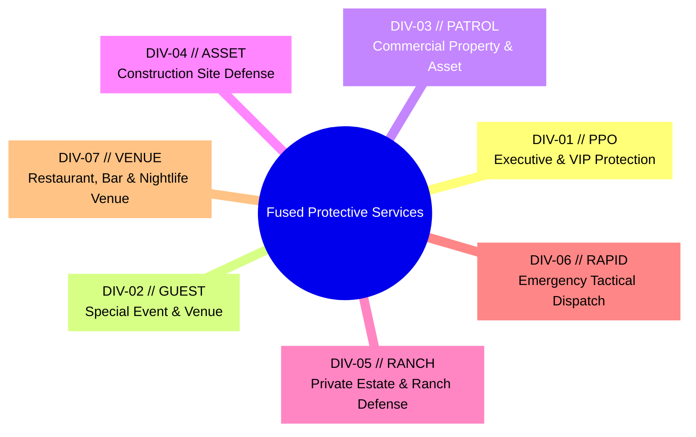

# Business & Domain Context — Fused Protective Services

This document defines the business architecture, operational domain, client profile, service divisions, rate card economics, and intake funnels for **Fused Protective Services**.

---

## 🏢 Client Profile & Company Overview

* **Principal / Owner:** Cameron Harrell
* **Company Name:** Fused Protective Services (Short form: `FUSED`)
* **Headquarters:** Austin, Texas (30.2672° N, -97.7431° W)
* **Operational Territory:** Austin and San Antonio (primary areas of operation, including the I-35 corridor and Hill Country), plus Dallas, Fort Worth, Houston, and statewide Texas.
* **Corporate Motto:** `DEFENSE • DISCRETION • INTEGRITY`
* **Licensing & Regulatory Authority:** Texas Department of Public Safety (DPS) Private Security Board (PSB) under Texas Occupations Code §1702.
* **Insurance & Underwriting:** $2,000,000+ aggregate commercial general liability, armed liability riders, and statutory workers’ compensation coverage. Certificates of Insurance (COI) issued upon contract execution.

---

## 🎯 Value Proposition & Market Positioning

Fused Protective Services operates in the high-readiness, premium private security market. Unlike generic guard services that provide passive, low-wage deterrence, Fused provides:

1. **DPS Level II, III & IV Officers:** Commissioned armed and unarmed personnel trained in close protection, armed deterrence, tactical de-escalation, and secure motorcade transit.
2. **Verified Operational Experience:** Confirmed, skilled civilian protective professionals serve alongside military veterans and law enforcement; experience is verified with prior employers before rostering.
3. **< 45-Minute Tactical Dispatch:** Rapid response for urgent threats, executive emergencies, high-risk terminations, or sudden site vulnerabilities in the Austin and San Antonio metro areas.
4. **Verified Command Telemetry:** Real-time timestamped NFC/QR checkpoint scans, GPS patrol heatmaps, and post-shift digital audit trails delivered directly to client operations teams.

---

## 🛡️ The 7 Tactical Divisions

The company packages its security offerings into seven specialized divisions. These divisions represent the core service catalog and serve as the single source of truth across all marketing and intake workflows:



### Division Specifications

#### 1. DIV-01 // PPO: Executive & VIP Protection
* **Badge:** `LEVEL IV PPO CERTIFIED`
* **Intake Contract (`quoteValue`):** `Executive & VIP Close Protection (Level IV PPO)`
* **Description:** Discreet personal protection officers (PPO) providing low-profile armed escorts, advance route security, and secure transit for corporate executives, talent, family offices, and high-threat itineraries.
* **Operational Deliverables:** Plainclothes concealed armed escorts, advance route & venue reconnaissance, threat vulnerability assessments, and secure motorcade logistics.

#### 2. DIV-02 // GUEST: Special Event & Venue Security
* **Badge:** `LUXURY VENUE ACCESS`
* **Intake Contract (`quoteValue`):** `Special Event & Venue Security`
* **Description:** Comprehensive crowd management, guest list screening, VIP area isolation, and diplomatic de-escalation for luxury weddings, galas, corporate summits, concerts, and estate parties.
* **Operational Deliverables:** Guest list access control, customer-facing de-escalation, VIP green room / stage perimeter lockdowns, emergency medical first-response.

#### 3. DIV-03 // PATROL: Commercial Property & Asset Patrol
* **Badge:** `GPS CHECKPOINT VERIFIED`
* **Intake Contract (`quoteValue`):** `Commercial & Property Patrol`
* **Description:** Marked mobile cruiser patrols and dedicated static guard posts deterring vandalism, trespassing, and liability risks across office complexes, retail centers, and automotive dealerships.
* **Operational Deliverables:** High-visibility marked patrol cruisers, timestamped GPS checkpoint scans, after-hours lockup sweeps, trespass enforcement.

#### 4. DIV-04 // ASSET: Construction Site Defense
* **Badge:** `LOSS PREVENTION SQUAD`
* **Intake Contract (`quoteValue`):** `Construction Site Security`
* **Description:** Heavy machinery defense, copper/material loss prevention, and strict subcontractor gate management for active commercial and residential building developments.
* **Operational Deliverables:** 24/7 gate access logging, thermal night patrols, copper/equipment theft deterrence, law enforcement liaison.

#### 5. DIV-05 // RANCH: Private Estate & Ranch Defense
* **Badge:** `ESTATE BOUNDARY DEFENSE`
* **Intake Contract (`quoteValue`):** `Private Estate & Ranch Defense`
* **Description:** Dedicated access gate monitoring, roving perimeter officers, and immediate alarm dispatch protecting high-value private residences and expansive Texas Hill Country ranches.
* **Operational Deliverables:** Gatehouse access management, ATV / mobile acreage roving patrols, dedicated rapid alarm response, anti-paparazzi privacy shielding.

#### 6. DIV-06 // RAPID: Emergency Tactical Dispatch
* **Badge:** `UNDER 45-MIN DISPATCH` (Urgent Tone)
* **Intake Contract (`quoteValue`):** `Emergency Tactical Dispatch`
* **Description:** Immediate short-term deployment of commissioned armed officers for urgent workplace violence threats, high-risk employee terminations, or sudden property vulnerabilities.
* **Operational Deliverables:** Under 45-minute rapid urban deployment, high-threat deterrence units, workplace termination standing details, short-term physical asset lockdowns.

#### 7. DIV-07 // VENUE: Restaurant, Bar & Nightlife Venue Security
* **Badge:** `ENTERTAINMENT DISTRICT DETAIL`
* **Intake Contract (`quoteValue`):** `Restaurant, Bar & Nightlife Venue Security`
* **Description:** Door, floor, and parking-lot officers for restaurants, bars, lounges, and nightclubs: ID and capacity control, intoxicated-patron de-escalation, altercation intervention, closing-time staff escorts, and cash-drop protection across Austin and San Antonio entertainment districts.
* **Operational Deliverables:** ID verification / capacity counts / line management, intoxicated patron de-escalation and removal, floor roving and lot patrol, closing-time staff escorts and cash-drop protection.

---

## 💰 Rate Card & Estimator Economics

The platform provides clients with an interactive budget estimator. Rates are based on Texas security industry licensing tiers:

| Tier | Designation | Hourly Rate | Standard Shift | Primary Armed Preference | Default Division Mapping |
| :--- | :--- | :--- | :--- | :--- | :--- |
| **Level II** | Unarmed Security Officer | **$45 / hr** | 4 – 24 hrs | Unarmed (`Level II`) | None (custom selection) |
| **Level III** *(Default)* | Armed Commissioned Officer | **$65 / hr** | 4 – 24 hrs | Armed (`Level III / IV`) | Commercial & Property Patrol |
| **Level IV** | Executive PPO Bodyguard | **$95 / hr** | 4 – 24 hrs | Armed (`Level III / IV`) | Executive & VIP Close Protection |

### Calculation Formula
$$\text{Estimated Total} = \text{Hourly Rate} \times \text{Number of Officers} \ (1\text{ to }15) \times \text{Shift Hours} \ (4\text{ to }24)$$

* **Default State on Load:** Level III Armed ($65/hr) × 2 Officers × 8 Hours = **$1,040.00**.
* **Call to Action:** Clicking "Lock In Deployment Slot" captures the selected tier, officer count, and estimated budget, pre-filling the quote intake form automatically.

---

## 📋 The 60-Second Threat Assessment Logic

The platform provides a guided assessment quiz (`src/data/assessment.mjs`) to route prospective clients to the appropriate security posture:

### Step 1: Operational Environment
* **Executive Travel / VIP Escort** $\rightarrow$ Recommends `ppo` (`Level IV PPO + Plainclothes Escort`)
* **Luxury Event / Wedding / Gala** $\rightarrow$ Recommends `squad` (`Level III Armed Squad`)
* **Restaurant / Bar / Nightlife Venue** $\rightarrow$ Recommends `squad` (`Level III Armed Squad`, mixed armed + concierge preference)
* **Commercial Property / Complex** $\rightarrow$ Recommends `patrol` (`24/7 Mobile Patrol + Level III Guard`)
* **Construction Site** $\rightarrow$ Recommends `patrol` (`24/7 Mobile Patrol + Level III Guard`)

### Step 2: Crowd Size & Threat Escalation
* **Low / Intimate (< 100 Guests):** `escalate: false`
* **Moderate / Public (100–500 Attendees):** `escalate: false`
* **High Profile / VIP Media Attention:** `escalate: true`
* **Elevated / Immediate Known Threat:** `escalate: false`

### Resolution Matrix
```javascript
export const resolve = (environment, threat) =>
    threat?.escalate ? 'ppo' : (environment?.recommend ?? 'squad');
```
* **Strategic Rule:** High-profile public exposure outranks the venue environment and escalates the recommendation to Level IV PPO. Otherwise, the operational environment determines the detail.

---

## 👮 Officer Pay Scales & Gear Policy (Careers)

Officer compensation (`src/data/careers.mjs` → `payScales`) is pegged to what security employers actually pay in the San Antonio–Austin market. These are employee pay bands, distinct from the client billing rates above.

| License Level | Hourly Pay Band | Typical Post |
| :--- | :--- | :--- |
| **Level IV PPO** | **$30 – $60** | Personal Protection Officer / executive detail |
| **Level III Armed** | **$20 – $40** | Commissioned armed patrol, post & venue |
| **Level II Unarmed** | **$16 – $25** | Non-commissioned concierge, gate & floor |
| **Command Dispatch** | **$18 – $25** | Tactical dispatcher / command desk |

* **Gear Policy:** Own approved duty gear is preferred. A repayable gear stipend is available at hire and is recovered through scheduled deductions from pay (`gearPolicy`).
* **Experience Standard:** Confirmed, skilled civilian protective personnel are recruited alongside military veterans and law enforcement; experience is verified in vetting Stage 1.

---

## How It Works — The Client Experience

The marketing section at `#lifecycle` explains the existing four-step service process in client language, driven by `src/data/protocol.mjs`:

1. **Your priorities:** Understand the client's concerns, location, schedule, and people or property needing protection.
2. **Your plan:** Agree on responsibilities, coverage hours, officer presence, access arrangements, and how concerns will be handled.
3. **Your protection:** Provide appropriately licensed officers briefed on the client's priorities and agreed plan.
4. **Your updates:** Explain the work completed, report concerns, and support decisions about future coverage.

The copy addresses safety, discretion, confidence, and the ability to focus on everyday responsibilities. It avoids acronyms, simulated operational records, precise response-time promises, and guaranteed outcomes. This is a client-facing explanation, not a change to internal operating procedures. Sean requested this rewrite and removal of the “TACTICAL INTELLIGENCE BRIEF” element on 2026-09-14.

---

## 🧾 Internal Invoicing Subsystem (`/invoice`)

In addition to client acquisition, the web platform includes a private, standalone invoicing engine for Cameron Harrell:

* **Access Route:** `/invoice` (`invoice.html`)
* **Invoice Numbering Standard:** `FPS-YYYY-####` (e.g., `FPS-2026-0001`). The counter advances strictly on invoice save.
* **Payment Terms:**
  * Due on Receipt (0 days)
  * Net 7 (7 days)
  * Net 15 (15 days)
  * Net 30 (30 days — *Default*)
* **Tax Policy:** Default rate is **8.25%** (Austin combined state 6.25% + local 2.00% sales tax on security services).
* **Storage Model:** Saved client invoices persist in client-side `localStorage`. No server database is required.
* **Export Model:** Browser print dialog triggers `@media print` CSS formatted precisely for single-page Letter paper.
