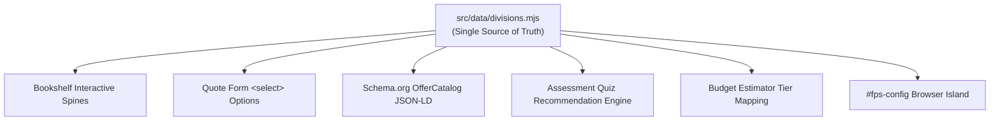
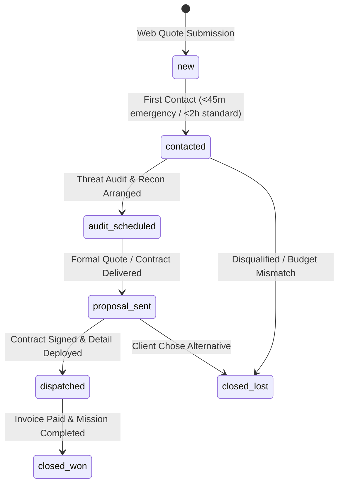
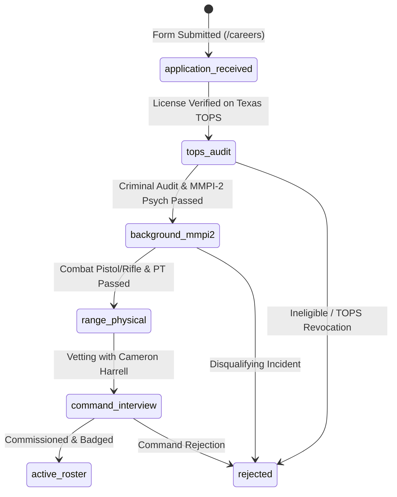

# Data Architecture & Schema Contracts — Fused Protective Services

This document details the single source of truth data architecture, cross-system contracts, schema definitions, and anti-drift guarantees governing the **Fused Protective Services** platform.

---

## 🛡️ The Anti-Drift Architecture

Before this data architecture existed, core business facts were hand-maintained in **five separate locations**:
1. The bookshelf interactive spines
2. The quote form `<select>` dropdown
3. The schema.org `OfferCatalog` structured data
4. The threat assessment quiz routing logic
5. The budget estimator tier mapping

This created severe documentation drift: the structured data declared only four divisions while the visual site sold six, rendering two entire business lines invisible to Google, Bing, and AI crawlers (ChatGPT, Perplexity).

### The Solution: One Truth, Infinite Projections
All facts now live strictly within `src/data/*.mjs`. The compiler reads each data file once and renders it across all presentation layers, search metadata, and client state islands simultaneously.



---

## 📜 The `quoteValue` Contract (CRITICAL)

The `quoteValue` property on each division object is the immutable contract tying the entire user journey together:

```javascript
// src/data/divisions.mjs
{
    id: 'div-01',
    code: 'DIV-01 // PPO',
    spineTitle: 'EXECUTIVE & VIP PROTECTION',
    quoteValue: 'Executive & VIP Close Protection (Level IV PPO)',
    // ...
}
```

> [!WARNING]
> **Never modify `quoteValue` without coordinated operational review.**
>
> `quoteValue` matches:
> 1. The `data-division` attribute on bookshelf deploy buttons.
> 2. The `<option value="...">` in the quote intake form.
> 3. The string injected by the assessment quiz when pre-filling the form.
> 4. The string injected by the estimator calculator when locking in a tier.
> 5. The exact payload received by Cameron's dispatch operations team.
>
> Changing `quoteValue` breaks form auto-selection and corrupts lead classification.

---

## 🗃️ Data Modules & Schemas

### 1. `src/data/site.mjs` — Global Facts & Brand Footprint
Defines brand identity, SEO copy, contact numbers, and site metrics.

```typescript
interface SiteConfig {
    url: string;                     // Canonical origin
    name: string;                    // "Fused Protective Services"
    shortName: string;               // "FUSED"
    motto: string;                   // "DEFENSE • DISCRETION • INTEGRITY"
    copyrightYear: number;           // Fixed integer (e.g. 2026) for build determinism
    phone: {
        display: string;             // "(512) 555-0199" (Placeholder)
        e164: string;                // "+15125550199"
    };
    email: string;                   // "dispatch@fusedprotectiveservices.com"
    address: {
        locality: string;            // "Austin"
        region: string;              // "TX"
        country: string;             // "US"
        latitude: string;            // "30.2672"
        longitude: string;           // "-97.7431"
    };
    areaServed: Array<{ type: 'City' | 'State'; name: string }>;
    rating: { value: string; count: string; best: string };
    seo: Record<string, string>;     // Titles, OpenGraph, Twitter, ChatGPT/Perplexity copy
}
```

### 2. `src/data/divisions.mjs` — The 7 Divisions
The primary catalog of services rendered into the bookshelf, form, and SEO schemas.

```typescript
interface Division {
    id: string;                      // Unique slug (e.g. "div-01")
    code: string;                    // Tactical callout (e.g. "DIV-01 // PPO")
    icon: string;                    // Key in icons.mjs
    spineTitle: string;              // Text displayed on the collapsed bookshelf spine
    badge: string;                   // Credential pill (e.g. "LEVEL IV PPO CERTIFIED")
    badgeTone?: 'urgent';            // Visual alert styling (used for DIV-06)
    /* DIV-07 (Restaurant, Bar & Nightlife) uses icon key 'nightlife' */
    heading: string;                 // Detailed title in expanded state
    description: string;             // Detailed marketing copy
    checklist: string[];             // 4 tactical deliverables
    quoteValue: string;              // System-wide immutable intake identifier
    schema: {
        name: string;                // Schema.org Service name
        description: string;         // Schema.org Service description
    };
}
```

### 3. `src/data/estimator.mjs` — Rate Cards & Sliders
Controls the budget calculator and pre-populates rates across the site and invoice tool.

```typescript
interface Tier {
    id: string;                      // "level-2" | "level-3" | "level-4"
    label: string;                   // "Level II" | "Level III" | "Level IV"
    sublabel: string;                // "Unarmed Guard" | "Armed Officer" | "Executive PPO"
    name: string;                    // Full display title
    rate: number;                    // Hourly billing rate ($45, $65, $95)
    armed: string;                   // Maps to armedPreferences string
    division: string | null;         // Pre-selected division quoteValue
    default?: boolean;               // Level III is marked true
}

interface Ranges {
    officers: { min: 1; max: 15; value: 2 };
    hours: { min: 4; max: 24; value: 8 };
}
```

### 4. `src/data/assessment.mjs` — Threat Assessment Steps
Configures the interactive quiz and deterministic outcome resolution.

```typescript
interface AssessmentStep {
    id: 'environment' | 'threat';
    title: string;
    options: Array<{
        id: string;
        icon: string;
        label: string;
        value: string;
        recommend?: 'ppo' | 'squad' | 'patrol';
        division?: string;           // Pre-fill target quoteValue
        armed?: string;              // Pre-fill target preference
        escalate?: boolean;          // If true, forces PPO regardless of environment
    }>;
}
```

### 5. `src/data/protocol.mjs` — Operational Phases
Drives the ARIA tablist component and interactive terminal diagnostic monitors.

```typescript
interface ProtocolStage {
    id: string;                      // "recon" | "post-orders" | "dispatch" | "telemetry"
    name: string;                    // Tab label (e.g. "Advance Recon & Audit")
    badge: string;                   // Tactical header pill
    heading: string;                 // Phase headline
    body: string;                    // Operational overview
    meta: Array<{ label: string; value: string }>;
    cta: string;                     // Button text
    terminal: {
        file: string;                // Simulated file (e.g. "RECON_DIAGNOSTIC_V4.LOG")
        lines: Array<string | { text: string; strong: string }>;
        status: string;              // Terminal status readout
    };
}
```

### 6. `src/data/faq.mjs` — FAQ & Structured Data
Renders both the visual accordion and the Google rich snippet JSON-LD metadata.

```typescript
interface FAQ {
    question: string;                // Rendered in <summary> and schema question
    answer: string;                  // Rendered in <details> body and schema answer
}
```

### 7. `src/data/intake.mjs` — Armed Preferences
Standard vocabulary connecting the quiz, calculator, and quote dropdown.

```javascript
export const armedPreferences = {
    armed: 'Armed Commissioned Officers (Level III / IV)',
    unarmed: 'Unarmed Uniformed Security (Level II)',
    mixed: 'Mixed Detail (Armed Tactical + Uniformed Concierge)',
    recommend: 'Command Recommendation Based on Assessment'
};
```

### 8. `src/data/invoice.mjs` — Invoicing Vocabulary
Governs numbering, payment terms, and Texas tax configuration for `/invoice`.

```javascript
export const numbering = { prefix: 'FPS', pad: 4 };
export const tax = { label: 'TX Sales Tax', defaultRatePct: 8.25 };
export const netTerms = [
    { id: 'due-on-receipt', label: 'Due on receipt', days: 0 },
    { id: 'net-7', label: 'Net 7', days: 7 },
    { id: 'net-15', label: 'Net 15', days: 15 },
    { id: 'net-30', label: 'Net 30', days: 30, default: true }
];
```

### 9. `src/data/careers.mjs` — Careers & Recruitment Vocabulary
Governs open protective positions, licensing tiers, vetting stages, and Google Jobs schema.

```typescript
interface Position {
    id: string;                      // "pos-ppo" | "pos-patrol" | "pos-event" ...
    code: string;                    // "POS-01 // PPO"
    title: string;                   // Position display title
    licenseTier: string;             // Texas DPS license prerequisite
    category: string;                // Category filter key
    location: string;                // Deployment jurisdiction
    schedule: string;                // Operational schedule
    compensation: string;            // Hourly compensation band
    badge: string;                   // Credential tag
    summary: string;                 // High-level overview
    requirements: string[];          // Mandatory qualifications
    duties: string[];                // Tactical post duties
    schema: {                        // Schema.org JobPosting object
        title: string;
        description: string;
        baseSalary: { minValue: number; maxValue: number; unit: string };
        employmentType: string;
    };
}
```

---

## 🛠️ Step-by-Step Runbook: Adding a 7th Division

To add a new security division (e.g., *K9 Detection & Patrol Units*), follow this procedure:

1. Open `src/data/divisions.mjs`.
2. Append a new division object to the `divisions` array:
   ```javascript
   {
       id: 'div-07',
       code: 'DIV-07 // K9',
       icon: 'k9',                   // Ensure icon exists in src/data/icons.mjs
       spineTitle: 'K9 TACTICAL PATROL',
       badge: 'CANINE DETECTION SQUAD',
       heading: 'K9 Explosive & Intrusion Patrol',
       description: 'Dual-purpose certified protection canines...',
       checklist: [
           'Explosive & Narcotics Sweeps',
           'High-Intrusion Deterrence Patrol',
           'Handler Level III Armed Certification',
           'Crowd Perimeter Interception'
       ],
       quoteValue: 'K9 Tactical & Detection Patrol',
       schema: {
           name: 'K9 Tactical & Detection Patrol',
           description: 'Certified canine handlers for perimeter deterrence.'
       }
   }
   ```
3. Run `node build.mjs`.
4. Run `node build.mjs --check` to verify zero drift.
5. The 7th division will automatically appear in:
   - The interactive bookshelf spine rail.
   - The quote form `<select>` menu.
   - The `<script type="application/ld+json">` `OfferCatalog` block for search engines.
   - The client-side `#fps-config` island.

---

## 🗄️ Relational Database Schema & State Machines (PostgreSQL / Supabase)

All inbound client quotes, officer candidate applications, and billing invoices persist to PostgreSQL conforming to the following database contracts:

### 1. `client_quotes` Table Schema
```sql
CREATE TABLE public.client_quotes (
    id UUID PRIMARY KEY DEFAULT gen_random_uuid(),
    ref_code TEXT NOT NULL UNIQUE,          -- Format: TX-FPS-####
    full_name TEXT NOT NULL,                -- Client Point of Contact
    company TEXT,                           -- Organization / Entity
    phone TEXT NOT NULL,                    -- Direct telephone number
    email TEXT NOT NULL,                    -- Contact email address
    service_division TEXT NOT NULL,         -- Matches division quoteValue
    armed_preference TEXT NOT NULL,         -- Matches armedPreference
    deployment_location TEXT NOT NULL,      -- Venue / City / Address
    schedule TEXT NOT NULL,                 -- Date(s) and shift timing
    notes TEXT,                             -- Threat context and instructions
    status TEXT NOT NULL DEFAULT 'new'      -- State machine
        CHECK (status IN ('new', 'contacted', 'audit_scheduled', 'proposal_sent', 'dispatched', 'closed_won', 'closed_lost')),
    priority TEXT NOT NULL DEFAULT 'standard'
        CHECK (priority IN ('standard', 'priority', 'emergency')),
    estimated_value NUMERIC(10, 2) DEFAULT 0.00,
    hubspot_deal_id TEXT,
    created_at TIMESTAMPTZ NOT NULL DEFAULT NOW(),
    updated_at TIMESTAMPTZ NOT NULL DEFAULT NOW()
);
```

#### Client Deal State Machine


---

### 2. `candidate_applications` Table Schema
```sql
CREATE TABLE public.candidate_applications (
    id UUID PRIMARY KEY DEFAULT gen_random_uuid(),
    ref_code TEXT NOT NULL UNIQUE,          -- Format: TX-CAND-####
    position_id TEXT NOT NULL,              -- Matches careers.mjs position id
    license_level TEXT NOT NULL,            -- Texas DPS licensure tier
    full_name TEXT NOT NULL,                -- Candidate legal name
    phone TEXT NOT NULL,                    -- Candidate mobile phone
    email TEXT NOT NULL,                    -- Candidate email address
    tops_number TEXT,                       -- Texas TOPS security license
    service_branch TEXT,                    -- Military / Law Enforcement branch
    bio TEXT NOT NULL,                      -- Background and certifications
    vetting_stage TEXT NOT NULL DEFAULT 'application_received'
        CHECK (vetting_stage IN ('application_received', 'tops_audit', 'background_mmpi2', 'range_physical', 'command_interview', 'active_roster', 'rejected')),
    hubspot_ticket_id TEXT,
    created_at TIMESTAMPTZ NOT NULL DEFAULT NOW(),
    updated_at TIMESTAMPTZ NOT NULL DEFAULT NOW()
);
```

#### Officer Vetting State Machine


