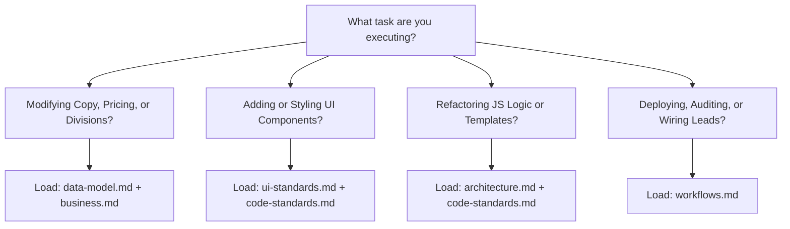

# Context Architecture Index — Fused Protective Services

Welcome to the context repository for **Fused Protective Services** (Cameron Harrell, Austin TX). This directory contains the authoritative, domain-separated engineering context designed for AI agents and human developers under modern **Context Engineering** standards.

---

## ⚡ The Prime Directive (The One Rule)

> [!CAUTION]
> **`index.html`, `css/site.css`, `invoice.html`, and `css/invoice.css` are GENERATED. NEVER edit them by hand.**
>
> All source code and copy live exclusively in `src/`. Whenever any file in `src/` is modified, regenerate the build output and verify it before committing:
> ```bash
> node build.mjs          # Recompile all HTML and CSS bundles
> node build.mjs --check  # Verify committed output matches src/ byte-for-byte
> python3 serve.py        # Preview locally at http://localhost:5050
> ```

---

## 🗺️ 7-File Context Architecture Map

The project knowledge base is partitioned into 7 modular, high-density steering documents. Rather than loading the entire context into memory, navigate directly to the document governing your specific task:

| Document | Primary Domain | Essential Concepts & Invariants |
| :--- | :--- | :--- |
| **[`index.md`](file:///Users/cope/projects/fused-protective-services/context/index.md)** | Master Index & Router | Operating rules, directory layout, progressive disclosure router, rule precedence. |
| **[`business.md`](file:///Users/cope/projects/fused-protective-services/context/business.md)** | Business & Domain Model | Cameron Harrell, Texas security market, 7 Divisions, rate cards, assessment quiz logic, invoice model. |
| **[`architecture.md`](file:///Users/cope/projects/fused-protective-services/context/architecture.md)** | Technical Architecture | Zero-dependency toolchain, `build.mjs`, tagged templates, WebGL voxel engine, `#fps-config` state island, invoice tool. |
| **[`data-model.md`](file:///Users/cope/projects/fused-protective-services/context/data-model.md)** | Data Layer & Contracts | Single Source of Truth (`src/data/`), `quoteValue` stability contract, schema.org JSON-LD, anti-drift architecture. |
| **[`code-standards.md`](file:///Users/cope/projects/fused-protective-services/context/code-standards.md)** | Engineering Guidelines | Escaping invariants (`html` vs `raw`), no inline handlers/styles, CSS `@layer` rules, `STYLE_ORDER`, 300 LOC limits, deterministic builds. |
| **[`ui-standards.md`](file:///Users/cope/projects/fused-protective-services/context/ui-standards.md)** | UI & Design System | Dark tactical aesthetic, gold/carbon color tokens, dual motion clocks (`--assembly` vs `--assembly-settled`), gold SVG emblems, WCAG 2.1 AA a11y baseline. |
| **[`workflows.md`](file:///Users/cope/projects/fused-protective-services/context/workflows.md)** | Operations & Runbooks | Local CLI commands, CI drift checks, Vercel/Cloudflare deployment, lead form `deliver()` seam, invoice workflow, Cameron's known gaps. |

---

## 🧭 Progressive Disclosure / Task Router

Consult this routing table to identify the minimal set of context files needed for your specific task:



| If you are... | Read these documents first: |
| :--- | :--- |
| **Adding or modifying a service division** | [`data-model.md`](file:///Users/cope/projects/fused-protective-services/context/data-model.md) & [`business.md`](file:///Users/cope/projects/fused-protective-services/context/business.md) |
| **Adjusting hourly rates or estimator formulas** | [`data-model.md`](file:///Users/cope/projects/fused-protective-services/context/data-model.md) & [`business.md`](file:///Users/cope/projects/fused-protective-services/context/business.md) |
| **Styling pages, buttons, or adding animations** | [`ui-standards.md`](file:///Users/cope/projects/fused-protective-services/context/ui-standards.md) & [`code-standards.md`](file:///Users/cope/projects/fused-protective-services/context/code-standards.md) |
| **Editing or creating HTML templates in `src/templates/`** | [`architecture.md`](file:///Users/cope/projects/fused-protective-services/context/architecture.md) & [`code-standards.md`](file:///Users/cope/projects/fused-protective-services/context/code-standards.md) |
| **Working with WebGL Logo Forge (`js/logo-forge.js`)** | [`architecture.md`](file:///Users/cope/projects/fused-protective-services/context/architecture.md) & [`ui-standards.md`](file:///Users/cope/projects/fused-protective-services/context/ui-standards.md) |
| **Connecting lead forms to an email/CRM endpoint** | [`workflows.md`](file:///Users/cope/projects/fused-protective-services/context/workflows.md) & [`data-model.md`](file:///Users/cope/projects/fused-protective-services/context/data-model.md) |
| **Deploying to production (Vercel / Cloudflare)** | [`workflows.md`](file:///Users/cope/projects/fused-protective-services/context/workflows.md) |
| **Auditing accessibility or keyboard navigation** | [`ui-standards.md`](file:///Users/cope/projects/fused-protective-services/context/ui-standards.md) |
| **Reviewing milestones, blockers, or backlog** | [`../PROGRESS.md`](file:///Users/cope/projects/fused-protective-services/PROGRESS.md) |

---

## 🗂️ Repository Directory Structure

```text
fused-protective-services/
├── build.mjs                  # The compiler toolchain (zero dependencies)
├── index.html                 # [GENERATED] Main marketing & intake page
├── invoice.html               # [GENERATED] Internal invoice generator (/invoice)
├── css/
│   ├── site.css               # [GENERATED] Compiled site stylesheet
│   └── invoice.css            # [GENERATED] Compiled invoice stylesheet
├── PROGRESS.md                # Living milestone, health & operational backlog tracker
├── PROJECT_CONTEXT.md         # Blueprint overview & context gateway
├── context/                   # Comprehensive 7-file AI & human context repository
│   ├── index.md               # Master index & context router (this file)
│   ├── business.md            # Client profile, market, divisions & economics
│   ├── architecture.md        # Technical architecture, compiler & subsystems
│   ├── data-model.md          # Single source of truth & cross-system contracts
│   ├── code-standards.md      # Code standards, escaping & CSS layers
│   ├── ui-standards.md        # Design system, tokens, motion & a11y baseline
│   └── workflows.md           # Developer workflows, deployments & known gaps
├── src/                       # SOURCE OF TRUTH (All edits happen here)
│   ├── lib/
│   │   └── html.mjs           # Escaping tagged template compiler primitive
│   ├── data/                  # Every business fact, rate, and copy snippet
│   │   ├── site.mjs           # Brand, phone, contact, metrics, SEO metadata
│   │   ├── divisions.mjs      # The 6 Tactical Divisions (Single Source of Truth)
│   │   ├── protocol.mjs       # The 4 deployment protocol phases
│   │   ├── assessment.mjs     # 60-second quiz steps, options & recommendation logic
│   │   ├── estimator.mjs      # Level II/III/IV tiers, hourly rates, slider limits
│   │   ├── intake.mjs         # Armed/unarmed preference vocabulary
│   │   ├── invoice.mjs        # Invoice numbering, terms, tax & legal copy
│   │   ├── faq.mjs            # Accordion Q&A and schema.org FAQ data
│   │   └── icons.mjs          # Bespoke gold tactical SVG icon library
│   ├── templates/             # HTML section generator modules
│   │   ├── page.mjs           # Page wrapper, JSON config island, script mounts
│   │   ├── head.mjs           # Metadata, OpenGraph, JSON-LD structured data
│   │   ├── hero.mjs           # Tactical headline & metrics
│   │   ├── assembly.mjs       # Scroll-driven voxel intro scaffolding
│   │   ├── bookshelf.mjs      # Tactical divisions interactive bookshelf
│   │   ├── protocol.mjs       # ARIA tablist deployment protocol section
│   │   ├── assessment.mjs     # Interactive threat assessment quiz
│   │   ├── estimator.mjs      # Interactive budget calculator
│   │   ├── quote.mjs          # Security detail intake form
│   │   ├── faq.mjs            # Native <details>/<summary> accordion
│   │   ├── nav.mjs            # Fixed header navigation & mobile drawer
│   │   ├── standards.mjs      # The Fused Standard credential badges
│   │   ├── footer.mjs         # Footer dispatch status & site links
│   │   ├── partials.mjs       # Reusable UI fragments (badges, buttons, icons)
│   │   └── invoice/           # Subsystem templates for invoice builder & print doc
│   └── styles/                # CSS source modules (ordered in build.mjs)
│       ├── tokens.css         # Design tokens, color palette, easing, spacing
│       ├── base.css           # Resets, typography, skip link, focus rings, reduced motion
│       ├── layout.css         # Structural grids, containers, section wrappers
│       ├── utilities.css      # Utility classes (screen reader only, text alignment)
│       └── components/        # Component styles (each <= 300 LOC)
├── js/                        # Client-side JavaScript (Native ESM)
│   ├── app.mjs                # Client entrypoint; boots and delegates all widgets
│   ├── invoice.mjs            # Invoicing tool entrypoint
│   ├── logo-forge.js          # WebGL Three.js voxel emblem assembler (~530 LOC)
│   └── modules/               # Single-responsibility interactive controllers
│       ├── ambient.mjs        # Particle canvas background & cursor spotlight glow
│       ├── assessment.mjs     # Quiz state machine & quote form pre-fill
│       ├── bookshelf.mjs      # Divisions expander & deploy button triggers
│       ├── config.mjs         # Reads #fps-config DOM data island safely
│       ├── drawer.mjs         # Mobile drawer menu navigation & focus trapping
│       ├── estimator.mjs      # Live budget calculator math & form routing
│       ├── protocol.mjs       # Accessible keyboard-navigated ARIA tablist
│       ├── quote-form.mjs     # Lead validation & deliver() submission seam
│       ├── invoice-form.mjs   # Live invoice document builder controller
│       └── invoice-store.mjs  # Browser localStorage persistence for invoices
├── assets/                    # Static assets
│   ├── logo.png               # 3D Brushed Gold Shield brand plate & voxel source
│   └── o-scroll.html          # Upstream Pixel Scroll Forge engine reference
├── serve.py                   # Zero-dependency Python 3 preview server (port 5050)
├── vercel.json                # Production deployment configuration
├── robots.txt                 # Search engine indexing rules
├── sitemap.xml                # Canonical XML sitemap
└── llms.txt                   # Machine-readable summary for external AI crawlers
```

---

## ⚖️ Precedence & Rule Hierarchy

When resolving potential ambiguities or conflicting instructions:

1. **The Generation Invariant Outranks Everything:** Never edit generated files (`index.html`, `invoice.html`, `css/*.css`). All edits must occur in `src/`.
2. **Data Layer Outranks Ad-Hoc Logic:** Never hardcode prices, division names, telephone numbers, or URLs in templates or scripts. Everything must read from `src/data/` or `#fps-config`.
3. **Escaped by Default:** Tagged template literals must escape all dynamic interpolations unless explicitly wrapped in `raw()`.
4. **Cascade Order is Explicit:** CSS order is strictly dictated by `STYLE_ORDER` in `build.mjs`, wrapped in CSS `@layer`. Never rely on filesystem alphabetical ordering.
5. **Deterministic Builds:** Code must produce byte-identical output regardless of the execution date or environment.
