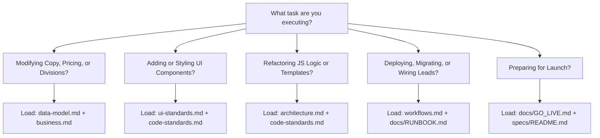

# Context Architecture Index — Fused Protective Services

Welcome to the context repository for **Fused Protective Services** (Cameron Harrell, Austin TX). This directory contains the authoritative, domain-separated engineering context for AI agents and human developers.

---

## ⚡ The Prime Directive (The One Rule)

> [!CAUTION]
> **`index.html`, `careers.html`, `invoice.html`, `privacy.html`, `terms.html`, `sms-consent.html`, `css/*.css` and `vercel.json` are GENERATED. NEVER edit them by hand.** The operations portal in `app/` is a separate Next.js workspace (see `context/architecture.md` and `context/workflows.md`).
>
> All source code and copy live in `src/`. Whenever any file in `src/` is modified, regenerate the build output and verify it before committing:
> ```bash
> node build.mjs                   # Regenerate every page, stylesheet and vercel.json
> node build.mjs --check           # Verify committed output matches src/ byte-for-byte
> node --test 'tests/*.test.mjs'   # Static-site and api/ tests
> python3 serve.py                 # Preview locally at http://localhost:5050 with production headers
> ```

---

## 🗺️ 8-File Context Architecture Map

Seven domain documents plus one tracker for the unit of work in progress. Navigate directly to the document governing your task:

| Document | Primary Domain | Essential Concepts & Invariants |
| :--- | :--- | :--- |
| **[`index.md`](index.md)** | Master Index & Router | Operating rules, directory layout, task router, rule precedence. |
| **[`business.md`](business.md)** | Business & Domain Model | Cameron Harrell, Texas security market, 7 Divisions, rate cards, assessment logic, How It Works copy, careers pay and copy decisions, invoicing model. |
| **[`architecture.md`](architecture.md)** | Technical Architecture | Zero-dependency toolchain, `build.mjs`, tagged templates, WebGL voxel engine with vendored three.js, `#fps-config` island, generated security headers, operations portal. |
| **[`data-model.md`](data-model.md)** | Data Layer & Contracts | Single Source of Truth (`src/data/`), `quoteValue` stability contract, schema.org JSON-LD, Postgres tables and state machines. |
| **[`code-standards.md`](code-standards.md)** | Engineering Guidelines | Escaping invariants (`html` vs `raw`), no inline handlers/styles (CSP-enforced), CSS `@layer` rules, `STYLE_ORDER`, 300 LOC limits, deterministic builds. |
| **[`ui-standards.md`](ui-standards.md)** | UI & Design System | Dark tactical aesthetic, gold/carbon tokens, brand asset set, dual motion clocks, gold SVG emblems, visitor-facing copy decisions, WCAG 2.1 AA baseline. |
| **[`workflows.md`](workflows.md)** | Operations & Runbooks | Local commands, Git-driven Vercel deploys, `/api/intake` pipeline, portal workflows, migrations and hosted status, HubSpot bridge, known gaps. |
| **[`progress-tracker.md`](progress-tracker.md)** | Current Implementation Unit | Goal, completed steps, next steps, open questions and decisions for the unit in progress. |

**Beyond `context/`:** [`../PROGRESS.md`](../PROGRESS.md) (milestone history, system health, backlog) · [`../docs/GO_LIVE.md`](../docs/GO_LIVE.md) (ordered launch gates) · [`../specs/README.md`](../specs/README.md) (go-live engineering specs and inherited invariants) · [`../docs/RUNBOOK.md`](../docs/RUNBOOK.md) (accounts, env vars, deploys) · [`../docs/OPEN_QUESTIONS.md`](../docs/OPEN_QUESTIONS.md) (blocked on Cameron) · [`../docs/INCIDENT.md`](../docs/INCIDENT.md) · [`../docs/RESTORE-DRILL.md`](../docs/RESTORE-DRILL.md) · [`../docs/A11Y-AUDIT.md`](../docs/A11Y-AUDIT.md) (measured accessibility).

---

## 🧭 Progressive Disclosure / Task Router



| If you are... | Read these documents first: |
| :--- | :--- |
| **Adding or modifying a service division** | [`data-model.md`](data-model.md) & [`business.md`](business.md) |
| **Adjusting hourly rates or estimator formulas** | [`data-model.md`](data-model.md) & [`business.md`](business.md) |
| **Changing visitor-facing copy** | [`business.md`](business.md) & [`ui-standards.md`](ui-standards.md) (copy decisions) |
| **Styling pages, buttons, or adding animations** | [`ui-standards.md`](ui-standards.md) & [`code-standards.md`](code-standards.md) |
| **Editing or creating HTML templates in `src/templates/`** | [`architecture.md`](architecture.md) & [`code-standards.md`](code-standards.md) |
| **Working with the WebGL Logo Forge (`js/logo-forge.js`)** | [`architecture.md`](architecture.md) & [`ui-standards.md`](ui-standards.md) |
| **Changing the intake pipeline or lead delivery** | [`workflows.md`](workflows.md) & [`data-model.md`](data-model.md) |
| **Adding a migration or touching the hosted database** | [`workflows.md`](workflows.md) & [`../docs/RUNBOOK.md`](../docs/RUNBOOK.md) §1 |
| **Deploying to production** | [`workflows.md`](workflows.md) & [`../docs/RUNBOOK.md`](../docs/RUNBOOK.md) §5 |
| **Changing security headers, three.js or fonts** | [`../docs/RUNBOOK.md`](../docs/RUNBOOK.md) §8b |
| **Something is broken in production** | [`../docs/INCIDENT.md`](../docs/INCIDENT.md) |
| **Auditing accessibility or keyboard navigation** | [`ui-standards.md`](ui-standards.md) & [`../docs/A11Y-AUDIT.md`](../docs/A11Y-AUDIT.md) |
| **Picking up go-live engineering work** | [`../specs/README.md`](../specs/README.md) & [`../docs/GO_LIVE.md`](../docs/GO_LIVE.md) |
| **Reviewing milestones, blockers, or backlog** | [`../PROGRESS.md`](../PROGRESS.md) & [`progress-tracker.md`](progress-tracker.md) |

---

## 🗂️ Repository Directory Structure

```text
fused-protective-services/
├── build.mjs                  # Static-site compiler (zero dependencies); also generates vercel.json
├── index.html                 # [GENERATED] Marketing & intake page
├── careers.html               # [GENERATED] Recruiting page (/careers)
├── privacy.html               # [GENERATED] Legal pages, with terms.html and sms-consent.html
├── invoice.html               # [GENERATED] Legacy invoice export (/invoice)
├── vercel.json                # [GENERATED] Clean URLs, CSP (inline-script hashes), HSTS
├── css/                       # [GENERATED] site.css, invoice.css, noscript.css
├── PROGRESS.md                # Milestone history, system health & backlog
├── PROJECT_CONTEXT.md         # Blueprint overview & context gateway
├── context/                   # This 8-file context repository
├── docs/                      # GO_LIVE, RUNBOOK, OPEN_QUESTIONS, INCIDENT, RESTORE-DRILL, A11Y-AUDIT
├── specs/                     # Eleven go-live specs + shared invariants
├── src/                       # SOURCE OF TRUTH (all site edits happen here)
│   ├── lib/html.mjs           # Escaping tagged template primitive
│   ├── data/                  # Every business fact, rate, and copy snippet
│   │   ├── site.mjs           # Brand, dispatch phone, DPS licence (placeholder), hosts, assets, SEO
│   │   ├── divisions.mjs      # The 7 divisions (single source of truth)
│   │   ├── protocol.mjs       # The four client-facing How It Works steps
│   │   ├── assessment.mjs     # Quiz steps, options & recommendation logic
│   │   ├── estimator.mjs      # Level II/III/IV tiers, hourly rates, slider limits
│   │   ├── intake.mjs         # Armed/unarmed preference vocabulary
│   │   ├── careers.mjs        # Positions, pay scales, vetting stages, gear policy
│   │   ├── invoice.mjs        # Numbering, terms, tax (shared with the portal)
│   │   ├── legal.mjs          # Privacy, terms and SMS program copy + review flag
│   │   ├── reviews.mjs        # Real reviews only; drives the schema.org rating
│   │   ├── faq.mjs            # Accordion Q&A and schema.org FAQ data
│   │   └── icons.mjs          # Bespoke gold SVG icon library
│   ├── templates/             # One module per section; careers/ and invoice/ subfolders
│   └── styles/                # tokens, base (self-hosted @font-face), layout, utilities, components/ (≤300 LOC each)
├── js/
│   ├── app.mjs                # Site entrypoint; boots every widget
│   ├── invoice.mjs            # Legacy export entrypoint
│   ├── logo-forge.js          # WebGL voxel emblem assembler (~560 LOC, kept whole)
│   ├── vendor/                # three.js r160, vendored and hash-checked (no CDN)
│   └── modules/               # ambient, assessment, bookshelf, careers, config, drawer, error-report,
│                              # estimator, invoice-store, protocol, quote-form, reveal
├── api/                       # Vercel functions: intake.mjs, client-error.mjs; _lib/ transports
├── app/                       # Operations portal — Next.js 16 + Supabase (own package.json, pnpm)
├── supabase/migrations/       # 15 additive migrations (hosted status in workflows.md)
├── tests/                     # node --test suites for the static site and api/
├── assets/                    # logo.png master, logo.webp, icons, og-card.png, fonts/, o-scroll.html reference
├── scripts/                   # build-assets.sh, og-card.mjs (brand derivatives, run by hand)
├── serve.py                   # Local preview server (port 5050), sends the vercel.json headers
├── robots.txt · sitemap.xml   # Search engine indexing rules and canonical sitemap
└── llms.txt                   # Machine-readable summary for AI crawlers
```

---

## ⚖️ Precedence & Rule Hierarchy

When resolving ambiguities or conflicting instructions:

1. **The Generation Invariant Outranks Everything:** Never edit generated files (every page, `css/*.css`, `vercel.json`). All edits occur in `src/` (or `build.mjs` for headers).
2. **Data Layer Outranks Ad-Hoc Logic:** Never hardcode prices, division names, telephone numbers, or URLs in templates, scripts or portal modules. Everything reads from `src/data/`, `#fps-config`, or `app/shared/`.
3. **Escaped by Default:** Tagged template literals escape all dynamic interpolations unless explicitly wrapped in `raw()`.
4. **Cascade Order is Explicit:** CSS order is dictated by `STYLE_ORDER` in `build.mjs`, wrapped in CSS `@layer`. Never rely on filesystem ordering.
5. **Deterministic Builds:** Output must be byte-identical regardless of date, environment or network.
6. **No Fake Success:** A missing key or skipped send is reported with its real reason, never as success. See `specs/README.md` for the full inherited invariants.
7. **Code Never Outruns the Database:** Apply a migration to the hosted project before or with the deploy that needs it; a Git push does not migrate.
